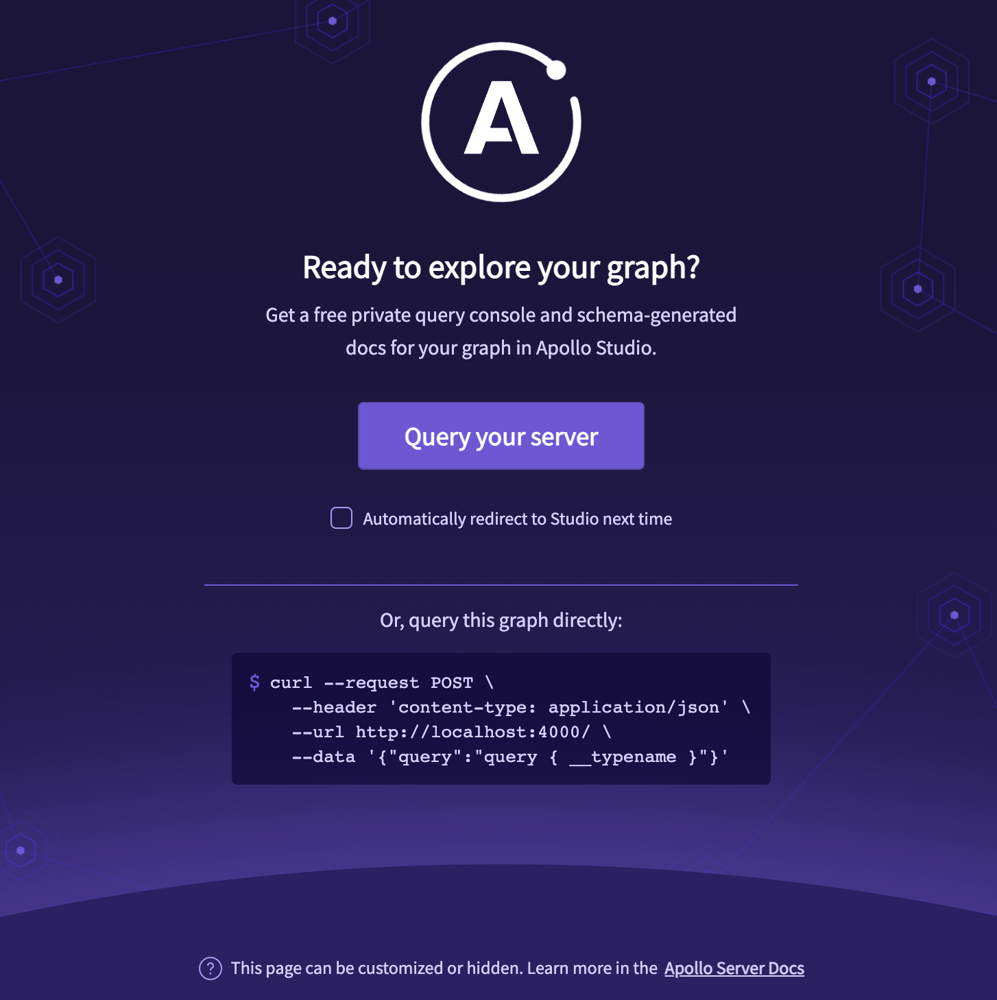

# 1.6 Deploy a supergraph on premises

In this lab section we are going to use graphQL **Apollo Gateway** to compose a supergraph from two existing subgraphs and deploy it on premises

## The Demo folder

In the demo folder you can find 2 graphQL services: races and matches.
They expose 2 federation-compatible subgraphs


A docker compose file to run the above services

## The gateway

Let's add a new Apollo Gateway service to out solution


Under demo, create a new folder named `gateway`

```bash
mkdir gateway
cd gateway
```

Initialize the new node application

```bash
npm init
```

The resulting package.json should look like this:

```json
{
  "name": "gateway-demo",
  "version": "1.0.0",
  "description": "",
  "main": "./src/index.js",
  "scripts": {
    "test": ""
  },
  "author": "",
  "license": "ISC"
}
```

Install the required packages

```bash
npm install apollo-server @apollo/gateway
```

and finally add an `index.js` file under `src` folder where we are going to create an Apollo Gateway instance.

```js
const { ApolloServer } = require("apollo-server");
const { ApolloGateway } = require("@apollo/gateway");
const { readFileSync } = require("fs");

const supergraphSdl = readFileSync("./src/supergraph.graphql").toString();

const gateway = new ApolloGateway({
  supergraphSdl,
});

const server = new ApolloServer({
  gateway,
});

const PORT = process.env.PORT || 4000;

server.listen({ port: PORT }).then(({ url }) => {
  console.log(`Server ready at ${url}`);
});
```

We now need to define `supergraph.graphql` and to do so we are going to use `rover CLI`

```bash
npm install -g @apollo/rover
```

To compose a supergraph schema from subgraphs we need a configuration file with the subgraphs information

In the root folder create `supergraph.yaml`

```yaml
subgraphs:
  races:
    routing_url: http://localhost:4001/graphql
    schema:
      subgraph_url: http://localhost:4001/graphql
  matches:
    routing_url: http://localhost:4002/graphql
    schema:
      subgraph_url: http://localhost:4002/graphql
```

We need to run the services to connect rover and save the supergraph schema to `src/supergraph.graphql`

```bash
docker compose up -d

rover supergraph compose --config ./supergraph.yaml > ./src/supergraph.graphql

docker compose down
```

Let's now create a `Dockerfile` for the gateway application

```Dockerfile
FROM node:18

WORKDIR /usr/src/app

COPY src ./src
COPY package.json ./
COPY supergraph.yaml ./

RUN npm install

CMD ["./src/index.js"]
```
and finally add the gateway server to `docker-compose.yaml`

```yaml
...
  gateway:
    build:
      context: ./gateway
      dockerfile: Dockerfile
    environment:
      PORT: 4000
    ports:
      - 4000:4000
    depends_on:
      - races
      - matches
...
```

Run docker compose and query the supergraph

```bash
docker compose up
```



## Next

You have completed this section

[< prev](./1_5_setup_supergraph_with_apollo_os.md) | [home](../readme.md) | [next >](./1_7_testing_with_postman.md)
